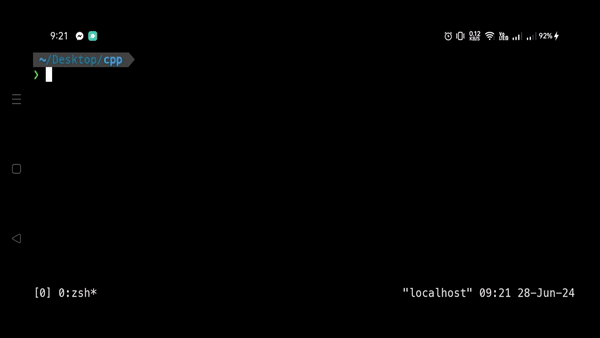
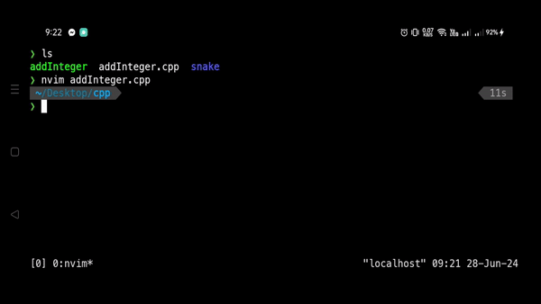

# Mobile IDE Project 📱
Turning Termux into a basic IDE for students that can't afford to buy laptops but still wants to code.

<div style="display:flex; justify-content:center; align-items:center;">
    
    
</div>

## Why use Termux?
Although very limited in terms of developing real applications, using our Android's Linux OS (ARM Architecture), we're able to do tasks like:

- Write CLI based programs
- Run CLI programs
- Work with GIT Repositories
- Develop Scripts (i.e python, js)
- Using SSH

## Tools that goes along with this installation

- Neovim - Our main editor
- GCC/G++/Clang - Our C compilers
- Nodejs - JavaScript runtime
- Python3 
- Git
- Tmux - Terminal Multiplexer

## Installation 

1. Install apt package manager
```
$ pkg install apt
```

2. Update apt
```
$ apt update 
```

3. Install Git to clone the needed repositories
```
$ apt install git
```

4. Clone this repository
```
$ apt install https://github.com/Atlas-Dev-0/MobileIDEProject.git
```

5. Open the directory
```
$ cd MobileIDEProject 
```

6. Make the *mobileIDEProject_install.sh* file executable
```
$ chmod +x mobileIDEProject_install.sh 
```

7. Execute and wait
```
$ ./mobileIDEProject_install.sh 
```

